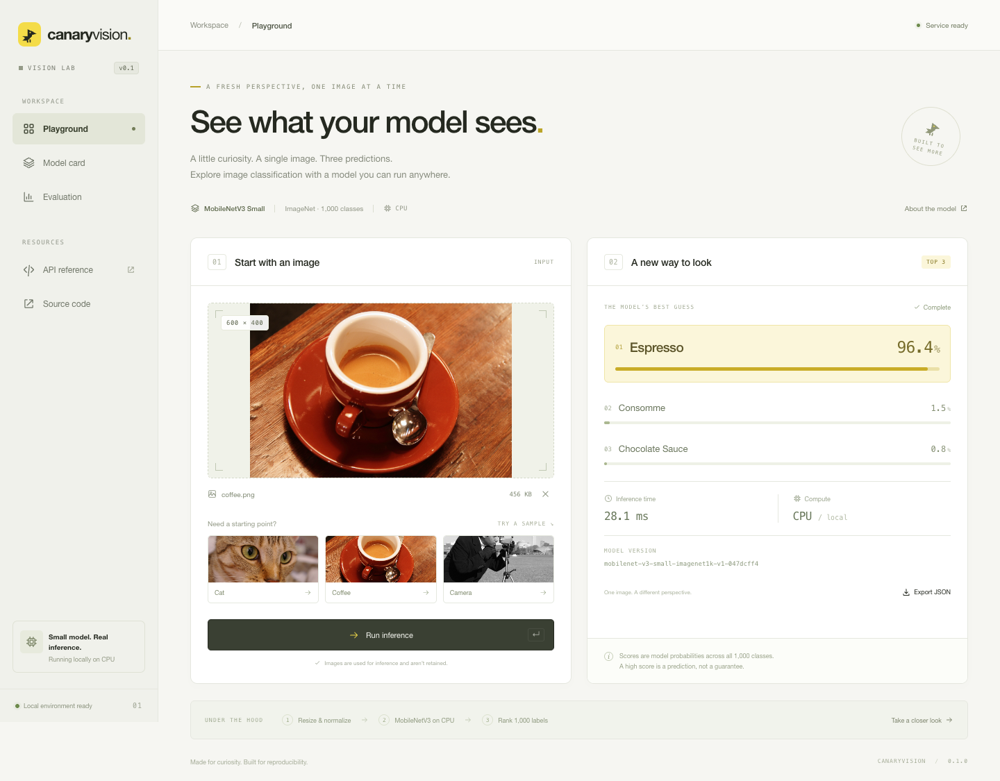

# CanaryVision

CPU image classification with FastAPI and pretrained MobileNetV3 Small. Upload
an image through the web interface or API to get the top three ImageNet labels,
scores, model version, and inference time.

Python · uv · PyTorch/torchvision · FastAPI · Docker · GitHub Actions



## Quick start

With Docker and Compose installed:

```sh
docker compose up --build
```

Open [localhost:8000](http://localhost:8000) or the
[API reference](http://localhost:8000/docs). The first build downloads dependencies
and model weights; the finished container runs without external network access.

For native setup, configuration, and browser checks, see the
[development guide](docs/development.md).

## Canary rollout

The **Roll out a new model** panel shows your current stable model alongside two
presets. Select **Reliable release** (good) or **Broken labels** (bad), then click
**Roll out selected model**. The traffic bar, stage tracker, and accuracy results
update as the rollout runs:

- The good preset passes the gates at **10% → 50% → 100%** traffic, then becomes
  the stable model. Each stage waits two seconds before checking the fixed dataset.
- The bad preset fails its first gate and **automatically rolls back**. The panel
  keeps the failed results visible and shows 100% of traffic restored to the
  previous stable model.
- **Roll back now** stops a candidate between checks. New requests return to the
  stable model; requests already running may finish on the candidate.

The presets share the verified MobileNetV3 Small weights. The good release
preserves baseline behavior; the deliberately bad release shifts ImageNet labels
by one position, reproducing a label-map packaging defect. No extra downloads are
needed. The current-model card updates after promotion, and presets can be rerun.

Choose **Load your own** to upload a **MobileNetV3 Small state dict** (`.pth` or
`.pt`, up to **32 MiB**), exported with `torch.save(model.state_dict(), "model.pth")`.
It must match the existing architecture, standard 1,000 ImageNet classes and label
order, and preprocessing. Loading uses `weights_only=True`, checks tensor values
and architecture, and warms the model before starting the same gated rollout.
Invalid files leave the stable model unchanged. Arbitrary architectures, full
pickled models, and custom label maps are not supported. Weights remain in memory
for the session; uploaded model files are closed after loading.

```sh
# Starts an automatic rollout; no advance calls needed.
curl -X POST http://localhost:8000/rollout/start/bad
curl http://localhost:8000/rollout

# Upload compatible weights and start automatic checks.
curl -F 'file=@model.pth' http://localhost:8000/rollout/upload
```

Automatic checks run on the server and continue when the browser closes. For
manual stage control through the API, `POST /rollout/good` or `/rollout/bad`
starts a candidate; `POST /rollout/advance` evaluates and advances one stage.
A successful manual rollout takes three advances. To evaluate the bad preset
offline (expected exit code **1**):

```sh
uv run --frozen python -m scripts.evaluate --release bad --output artifacts/bad-evaluation.json
```

This is a local, single-process rollout lab. Run one Uvicorn worker; state and
reports are kept in memory and restart resets to the original stable release.
Controls are unauthenticated and intended for the loopback-bound local service.
The gate uses four labeled samples, not accuracy inferred from user uploads. The
bundled `/evaluation` report continues to describe the original baseline.

## API

```sh
curl -F 'file=@evaluation/images/coffee.png' http://localhost:8000/predict
```

Example response; timing varies by machine:

```json
{
  "predictions": [
    {"label": "espresso", "score": 0.9639945},
    {"label": "consomme", "score": 0.0152125},
    {"label": "chocolate sauce", "score": 0.0077917}
  ],
  "model_version": "mobilenet-v3-small-imagenet1k-v1-047dcff4",
  "inference_ms": 27.49,
  "image": {"width": 600, "height": 400, "format": "PNG"},
  "request_id": "875c2af9-b6c7-4385-9418-b6fe19b3a977"
}
```

| Endpoint | Purpose |
| --- | --- |
| `POST /predict` | Classify an image uploaded in the multipart `file` field. |
| `GET /health` | Process liveness. |
| `GET /ready` | Model readiness and version. |
| `GET /model` | Model metadata and input limits. |
| `GET /evaluation` | Recorded evaluation report. |
| `GET /rollout` | Current traffic split, release versions, and gate reports. |
| `POST /rollout/start/{preset}` | Start an automatic `good` or `bad` rollout. |
| `POST /rollout/upload` | Upload compatible model weights and start an automatic rollout. |
| `POST /rollout/{action}` | Manual control: `good`, `bad`, `advance`, or `rollback`. |
| `GET /samples` | Sample images and attribution. |

Accepts static JPEG, PNG, and WebP images up to **10 MiB** and **20 megapixels**.
Uploads are not retained. Scores are probabilities over all 1,000 classes;
inference time covers preprocessing, the model forward pass, and scoring.

## Validation

After [native setup](docs/development.md#native-setup):

```sh
uv run --frozen ruff check .
uv run --frozen ruff format --check .
uv run --frozen pytest -q
uv run --frozen python -m scripts.evaluate
```

[CI](.github/workflows/ci.yaml) runs linting, API and model tests, evaluation,
browser checks, and an offline Docker smoke test. Reports are saved as workflow
artifacts.

The [four-image baseline](evaluation/baseline.json) scores **75% top-1** and
**100% top-3**; both gates require at least **75%**. This is a regression smoke
test, not a representative accuracy benchmark. The blurred clock is a top-1
miss, with `wall clock` ranked third. [Dataset notes](evaluation/README.md) cover
labels, checksums, and image permissions.

The model loads once per process. Dependencies, Docker base images, and model
weights are pinned; the container runs as a non-root user.
